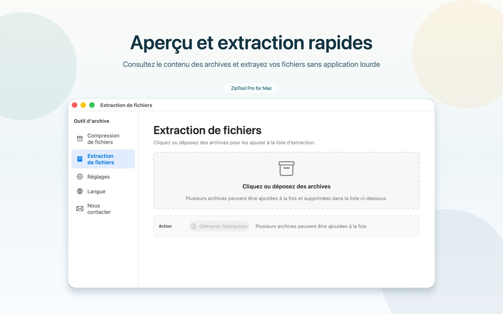
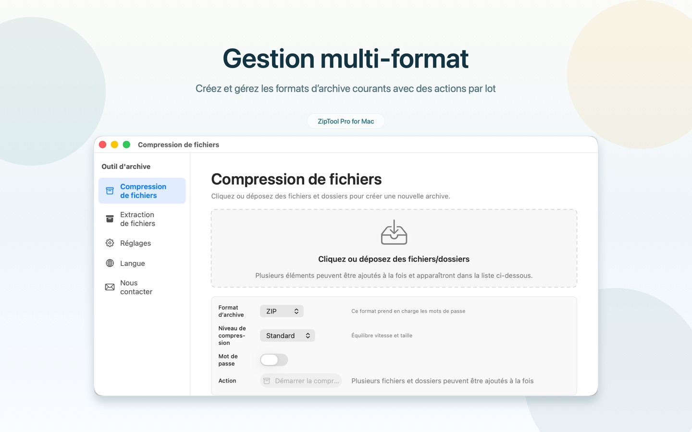

# ZipToolPro

[English](README.md) | [简体中文](README.zh-CN.md) | [日本語](README.ja.md) | [한국어](README.ko.md) | [Deutsch](README.de.md) | <b>Français</b> | [Español](README.es.md) | [Italiano](README.it.md) | [Português (Brasil)](README.pt-BR.md) | [Русский](README.ru.md) | [Українська](README.uk.md) | [Polski](README.pl.md) | [فارسی](README.fa.md)

ZipToolPro est un gestionnaire d’archives rapide et natif pour macOS. Parcourez vos archives sans les extraire, ouvrez directement les archives imbriquées, extrayez uniquement les fichiers dont vous avez besoin et créez des archives compressées, protégées par mot de passe si vous le souhaitez.

<p align="center">
  <a href="https://apps.apple.com/fr/app/id6778828246"></a>
</p>

<p align="center">Gratuit sur le Mac App Store sous le nom <b>Outil d'archive Pro</b></p>

## Captures d’écran

<p align="center">
  
</p>
<p align="center">
  
</p>

## Fonctionnalités

- **Parcourir sans extraire**: ouvrez une archive et consultez son contenu immédiatement
- **Archives imbriquées**: ouvrez une archive contenue dans une autre sans extraire la première
- **Extraire l’essentiel**: extrayez des fichiers ou dossiers individuels, ou tout le contenu
- **Créer des archives**: ZIP, 7Z, GZIP, BZIP2 et XZ, avec protection par mot de passe lorsque le format le permet
- **Archives chiffrées**: ouvrez les archives protégées par mot de passe
- **Coup d’œil (Quick Look)**: prévisualisez le contenu d’une archive dans le Finder avec la barre d’espace
- **36 formats**: 7z, zip, zipx, rar, tar, gz, bz2, xz, lz4, z, cab, arj, lha, sit, sitx, iso, dmg, pkg, xar, rpm, cpio, msi, wim, squashfs, vhd, vhdx, vmdk, vdi, qcow2 et bien d’autres
- **13 langues**: English, 简体中文, 日本語, 한국어, Deutsch, Français, Español, Italiano, Português (Brasil), Русский, Українська, Polski, فارسی

## Configuration requise

- macOS 12.0 ou version ultérieure
- Xcode 16 ou version ultérieure (pour compiler depuis les sources)

## Compiler depuis les sources

```bash
git clone --recursive https://github.com/huzitonglover/ZipToolPro.git
cd ZipToolPro
cp Config/SigningOverride.xcconfig.template Config/SigningOverride.xcconfig
# Modifiez SigningOverride.xcconfig et définissez DEVELOPMENT_TEAM avec votre Team ID
open ZipToolPro.xcodeproj
```

Si vous avez cloné sans `--recursive`, exécutez :

```bash
git submodule update --init --recursive
```

## Contribuer

Les issues et pull requests sont les bienvenues. Pour signaler un bug, indiquez votre version de macOS, votre version de ZipToolPro et, si possible, une archive d’exemple.

## Soutenir le projet

Si ZipToolPro vous est utile, vous pouvez soutenir son développement en scannant le QR code ci-dessous avec Alipay. Merci !

<p align="center"></p>

## Licence

Copyright © 2026 huzitonglover

ZipToolPro est un logiciel libre, distribué sous la [licence publique générale GNU v3.0](LICENSE).

## Remerciements

- Issu à l’origine de [MacPacker](https://github.com/sarensw/MacPacker) de sarensw (GPL-3.0)
- La prise en charge des archives repose sur [7-Zip](https://github.com/ip7z/7zip), [XADMaster](https://github.com/sarensw/XADMasterSwift), [SWCompression](https://github.com/tsolomko/SWCompression)
