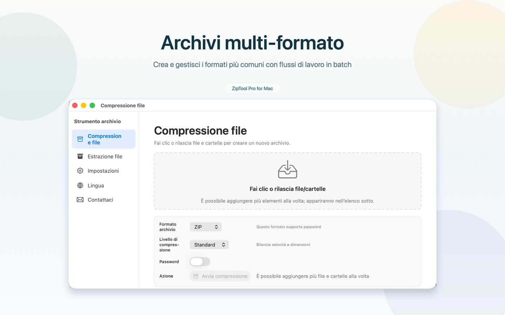

# ZipToolPro

[English](README.md) | [简体中文](README.zh-CN.md) | [日本語](README.ja.md) | [한국어](README.ko.md) | [Deutsch](README.de.md) | [Français](README.fr.md) | [Español](README.es.md) | <b>Italiano</b> | [Português (Brasil)](README.pt-BR.md) | [Русский](README.ru.md) | [Українська](README.uk.md) | [Polski](README.pl.md) | [فارسی](README.fa.md)

ZipToolPro è un gestore di archivi veloce e nativo per macOS. Puoi sfogliare gli archivi senza estrarli, aprire direttamente gli archivi annidati, estrarre solo i file che ti servono e creare archivi compressi con password opzionale.

<p align="center">
  <a href="https://apps.apple.com/it/app/id6778828246"></a>
</p>

<p align="center">Gratis sul Mac App Store come <b>Strumento archivio Pro</b></p>

## Screenshot

<p align="center">
  
</p>
<p align="center">
  
</p>

## Funzionalità

- **Sfoglia senza estrarre**: apri un archivio e consultane subito il contenuto
- **Archivi annidati**: apri un archivio contenuto in un altro senza estrarre quello esterno
- **Estrai solo ciò che serve**: estrai singoli file o cartelle, oppure tutto il contenuto
- **Crea archivi**: ZIP, 7Z, GZIP, BZIP2 e XZ, con protezione tramite password se il formato la supporta
- **Archivi cifrati**: apri archivi protetti da password
- **Quick Look**: visualizza l’anteprima del contenuto nel Finder premendo la barra spaziatrice
- **36 formati**: 7z, zip, zipx, rar, tar, gz, bz2, xz, lz4, z, cab, arj, lha, sit, sitx, iso, dmg, pkg, xar, rpm, cpio, msi, wim, squashfs, vhd, vhdx, vmdk, vdi, qcow2 e altri ancora
- **13 lingue**: English, 简体中文, 日本語, 한국어, Deutsch, Français, Español, Italiano, Português (Brasil), Русский, Українська, Polski, فارسی

## Requisiti

- macOS 12.0 o successivo
- Xcode 16 o successivo (per compilare dal codice sorgente)

## Compilare dal codice sorgente

```bash
git clone --recursive https://github.com/huzitonglover/ZipToolPro.git
cd ZipToolPro
cp Config/SigningOverride.xcconfig.template Config/SigningOverride.xcconfig
# Modifica SigningOverride.xcconfig e imposta DEVELOPMENT_TEAM con il tuo Team ID
open ZipToolPro.xcodeproj
```

Se hai clonato senza `--recursive`, esegui:

```bash
git submodule update --init --recursive
```

## Contribuire

Issue e pull request sono benvenute. Quando segnali un bug, indica la versione di macOS, la versione di ZipToolPro e, se possibile, un archivio di esempio.

## Sostieni il progetto

Se ZipToolPro ti è utile, puoi sostenerne lo sviluppo scansionando il codice QR qui sotto con Alipay. Grazie!

<p align="center"></p>

## Licenza

Copyright © 2026 huzitonglover

ZipToolPro è software libero, rilasciato sotto la [GNU General Public License v3.0](LICENSE).

## Ringraziamenti

- Derivato originariamente da [MacPacker](https://github.com/sarensw/MacPacker) di sarensw (GPL-3.0)
- Il supporto dei formati si basa su [7-Zip](https://github.com/ip7z/7zip), [XADMaster](https://github.com/sarensw/XADMasterSwift), [SWCompression](https://github.com/tsolomko/SWCompression)
