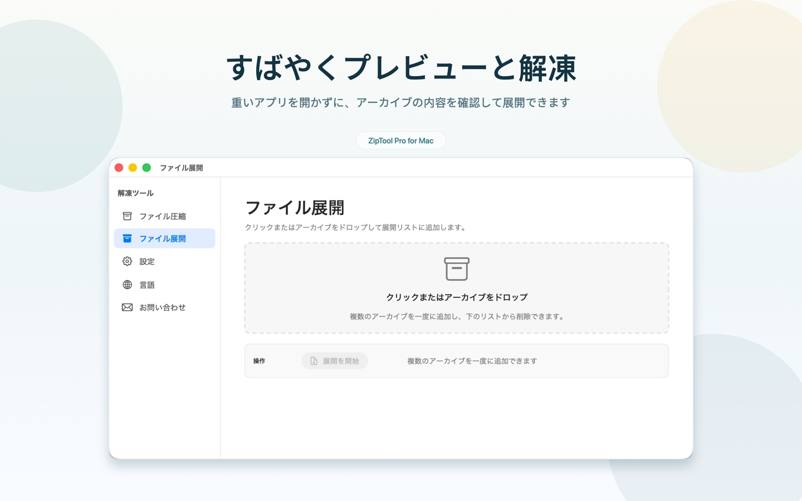
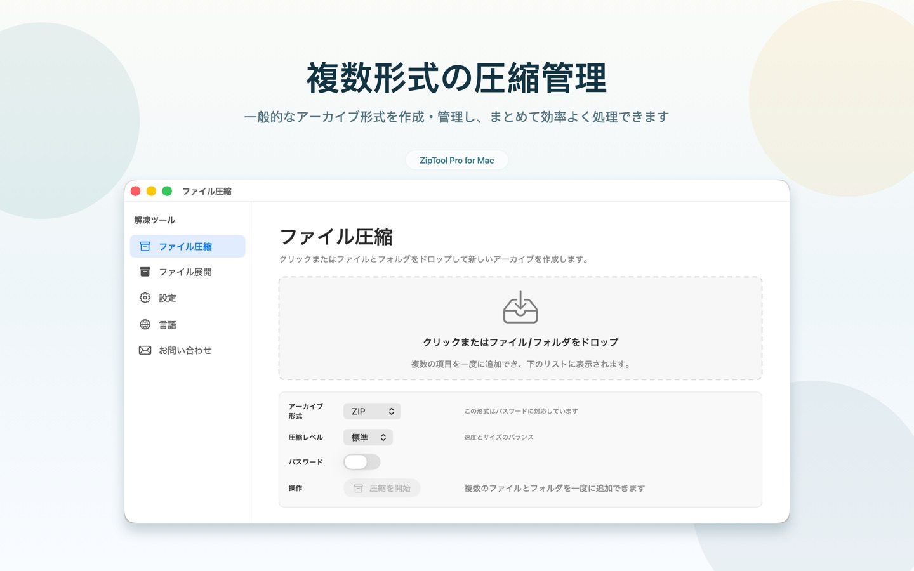

# ZipToolPro

[English](README.md) | [简体中文](README.zh-CN.md) | <b>日本語</b> | [한국어](README.ko.md) | [Deutsch](README.de.md) | [Français](README.fr.md) | [Español](README.es.md) | [Italiano](README.it.md) | [Português (Brasil)](README.pt-BR.md) | [Русский](README.ru.md) | [Українська](README.uk.md) | [Polski](README.pl.md) | [فارسی](README.fa.md)

ZipToolPro は、高速でネイティブな macOS 用アーカイブマネージャーです。解凍せずにアーカイブの中身を閲覧でき、入れ子になったアーカイブもそのまま開けます。必要なファイルだけを取り出したり、パスワード付きのアーカイブを作成したりすることもできます。

<p align="center">
  <a href="https://apps.apple.com/jp/app/id6778828246"></a>
</p>

<p align="center">Mac App Store で「<b>解凍ツール</b>」を無料でダウンロード</p>

## スクリーンショット

<p align="center">
  
</p>
<p align="center">
  
</p>

## 主な機能

- **解凍せずに閲覧**：アーカイブを開くだけで中身をすぐに確認
- **入れ子のアーカイブ**：外側を解凍しなくても、アーカイブ内のアーカイブを直接開ける
- **必要なものだけ解凍**：ファイルやフォルダを個別に取り出すことも、すべて解凍することも可能
- **アーカイブの作成**：ZIP、7Z、GZIP、BZIP2、XZ に対応。形式が対応していればパスワード保護も可能
- **暗号化アーカイブ**：パスワードで保護されたアーカイブを開ける
- **クイックルック**：Finder でスペースキーを押すだけでアーカイブの中身をプレビュー
- **36 種類の形式**：7z、zip、zipx、rar、tar、gz、bz2、xz、lz4、z、cab、arj、lha、sit、sitx、iso、dmg、pkg、xar、rpm、cpio、msi、wim、squashfs、vhd、vhdx、vmdk、vdi、qcow2 など
- **13 言語に対応**：English、简体中文、日本語、한국어、Deutsch、Français、Español、Italiano、Português (Brasil)、Русский、Українська、Polski、فارسی

## 動作環境

- macOS 12.0 以降
- Xcode 16 以降（ソースからビルドする場合）

## ソースからビルド

```bash
git clone --recursive https://github.com/huzitonglover/ZipToolPro.git
cd ZipToolPro
cp Config/SigningOverride.xcconfig.template Config/SigningOverride.xcconfig
# SigningOverride.xcconfig を編集し、DEVELOPMENT_TEAM にご自身の Team ID を設定してください
open ZipToolPro.xcodeproj
```

`--recursive` を付けずにクローンした場合は、次を実行してください：

```bash
git submodule update --init --recursive
```

## コントリビュート

Issue やプルリクエストを歓迎します。不具合を報告する際は、macOS のバージョン、ZipToolPro のバージョン、可能であれば再現用のアーカイブを添えてください。

## スポンサー

ZipToolPro が役に立ったら、下の QR コードを Alipay（支付宝）でスキャンして開発を支援していただけると嬉しいです。ありがとうございます！

<p align="center"></p>

## ライセンス

Copyright © 2026 huzitonglover

ZipToolPro はフリーソフトウェアであり、[GNU General Public License v3.0](LICENSE) のもとで公開されています。

## 謝辞

- sarensw による [MacPacker](https://github.com/sarensw/MacPacker)（GPL-3.0）をもとに開発されました
- アーカイブ処理には [7-Zip](https://github.com/ip7z/7zip), [XADMaster](https://github.com/sarensw/XADMasterSwift), [SWCompression](https://github.com/tsolomko/SWCompression) を使用しています
