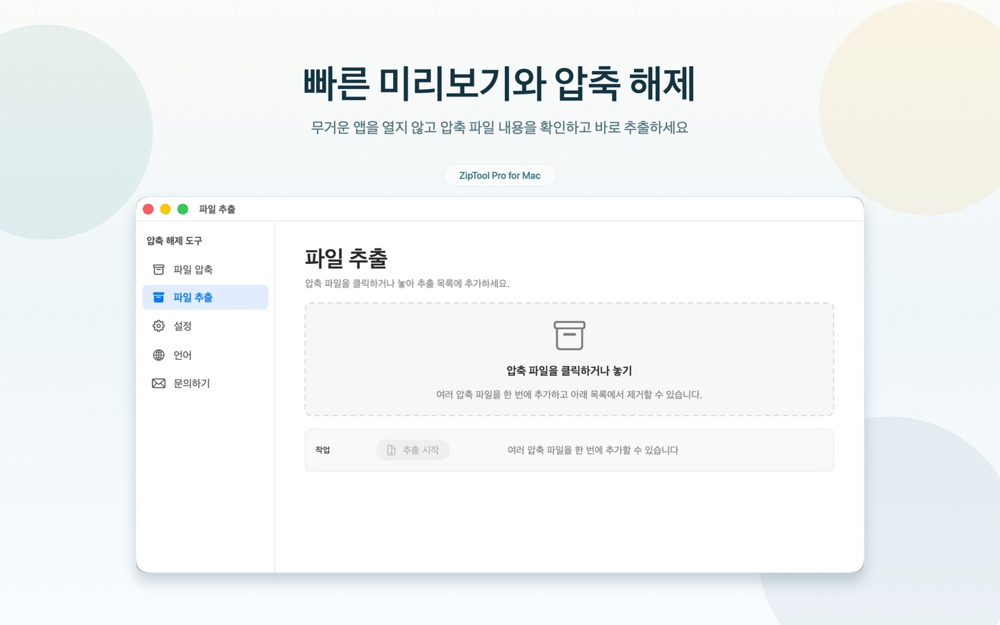
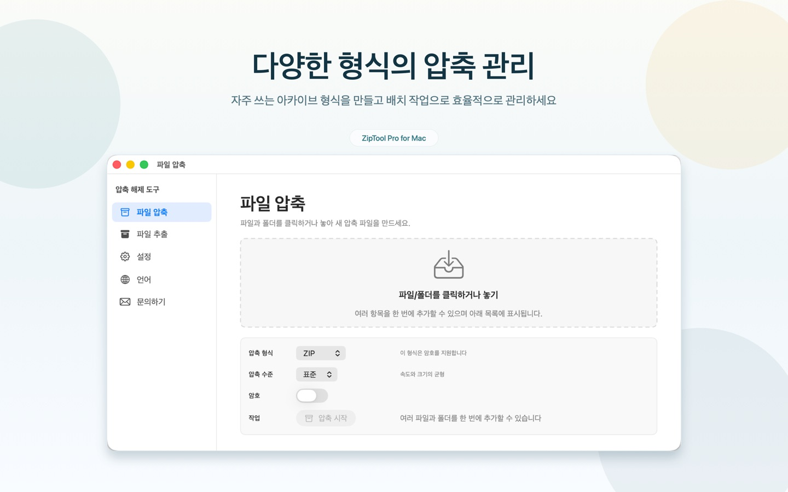

# ZipToolPro

[English](README.md) | [简体中文](README.zh-CN.md) | [日本語](README.ja.md) | <b>한국어</b> | [Deutsch](README.de.md) | [Français](README.fr.md) | [Español](README.es.md) | [Italiano](README.it.md) | [Português (Brasil)](README.pt-BR.md) | [Русский](README.ru.md) | [Українська](README.uk.md) | [Polski](README.pl.md) | [فارسی](README.fa.md)

ZipToolPro는 빠르고 네이티브한 macOS용 압축 파일 관리 앱입니다. 압축을 풀지 않고도 내용을 둘러볼 수 있고, 중첩된 압축 파일도 바로 열 수 있습니다. 필요한 파일만 골라 압축 해제하거나, 비밀번호가 걸린 압축 파일을 만들 수도 있습니다.

<p align="center">
  <a href="https://apps.apple.com/kr/app/id6778828246"></a>
</p>

<p align="center">Mac App Store에서 <b>압축 해제 도구</b>을(를) 무료로 다운로드하세요</p>

## 스크린샷

<p align="center">
  
</p>
<p align="center">
  
</p>

## 주요 기능

- **압축 해제 없이 탐색**: 압축 파일을 열면 바로 내용을 확인
- **중첩 압축 파일**: 바깥 압축 파일을 풀지 않고도 안에 있는 압축 파일을 바로 열기
- **필요한 것만 압축 해제**: 파일이나 폴더를 하나씩 꺼내거나 전체를 압축 해제
- **압축 파일 만들기**: ZIP, 7Z, GZIP, BZIP2, XZ 지원, 형식이 지원하면 비밀번호 보호 가능
- **암호화된 압축 파일**: 비밀번호로 보호된 압축 파일 열기
- **훑어보기(Quick Look)**: Finder에서 스페이스 바를 눌러 압축 파일 내용 미리보기
- **36가지 형식**: 7z, zip, zipx, rar, tar, gz, bz2, xz, lz4, z, cab, arj, lha, sit, sitx, iso, dmg, pkg, xar, rpm, cpio, msi, wim, squashfs, vhd, vhdx, vmdk, vdi, qcow2 등
- **13개 언어**: English, 简体中文, 日本語, 한국어, Deutsch, Français, Español, Italiano, Português (Brasil), Русский, Українська, Polski, فارسی

## 요구 사항

- macOS 12.0 이상
- Xcode 16 이상 (소스에서 빌드하는 경우)

## 소스에서 빌드하기

```bash
git clone --recursive https://github.com/huzitonglover/ZipToolPro.git
cd ZipToolPro
cp Config/SigningOverride.xcconfig.template Config/SigningOverride.xcconfig
# SigningOverride.xcconfig를 열어 DEVELOPMENT_TEAM을 본인의 Team ID로 설정하세요
open ZipToolPro.xcodeproj
```

`--recursive` 없이 클론했다면 다음을 실행하세요:

```bash
git submodule update --init --recursive
```

## 기여하기

이슈와 풀 리퀘스트를 환영합니다. 버그를 제보할 때는 macOS 버전, ZipToolPro 버전, 가능하다면 문제를 재현할 수 있는 압축 파일을 함께 첨부해 주세요.

## 후원하기

ZipToolPro가 도움이 되셨다면 아래 QR 코드를 Alipay(支付宝)로 스캔해 개발을 후원해 주세요. 감사합니다!

<p align="center"></p>

## 라이선스

Copyright © 2026 huzitonglover

ZipToolPro는 자유 소프트웨어이며 [GNU General Public License v3.0](LICENSE)에 따라 배포됩니다.

## 감사의 말

- sarensw의 [MacPacker](https://github.com/sarensw/MacPacker)(GPL-3.0)에서 출발했습니다
- 압축 형식 지원: [7-Zip](https://github.com/ip7z/7zip), [XADMaster](https://github.com/sarensw/XADMasterSwift), [SWCompression](https://github.com/tsolomko/SWCompression)
